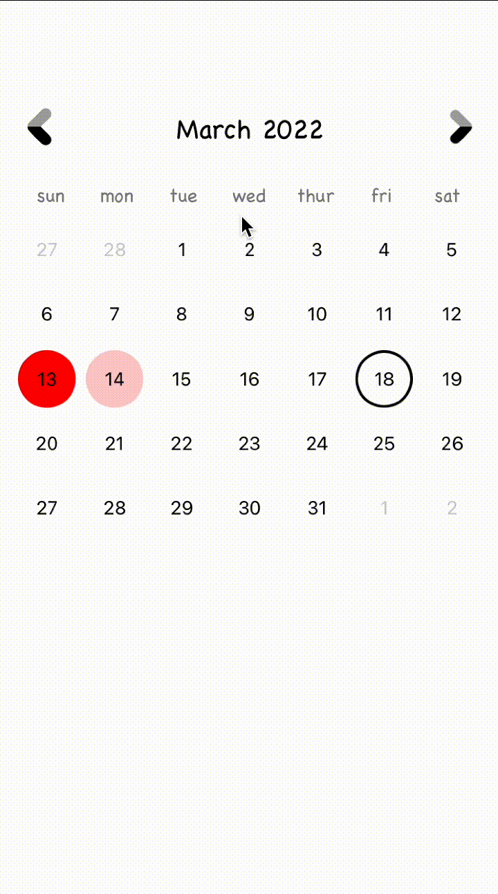

# Calendar

Custom Calendar view for your project on UIKit

You can add CalendarView to your UIViewController

Planned in future versions:
- support for horizontal orientation
- dark theme
- calendar view: year, week

